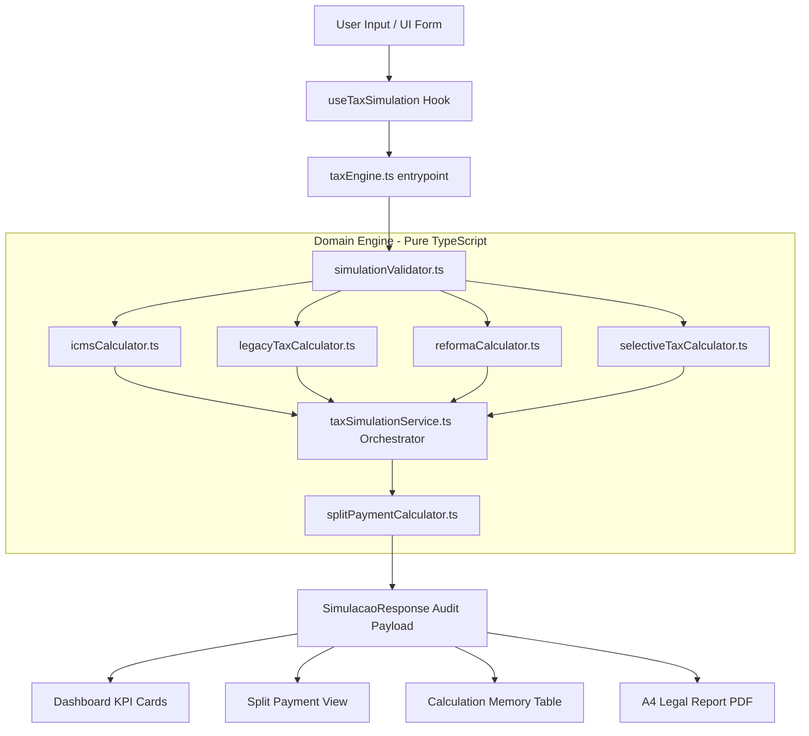

# Tax Reform Hub • Executive IBS / CBS / ZFM Simulator

[](README.pt-BR.md)
[](README.md)
[](https://www.typescriptlang.org/)
[](https://react.dev/)
[](https://vitejs.dev/)
[](https://tailwindcss.com/)
[](LICENSE)

A client-side tax engine and executive opinion generator that simulates the transition from Brazil's current tax model (PIS, COFINS, ICMS, ISS, Simples Nacional) to the new Dual VAT system (CBS, IBS, Selective Tax), specifically designed for CFOs, tax attorneys, accountants, and ERP architects navigating the Amazon State and Manaus Free Trade Zone (ZFM) constitutional rules.

---

## 1. Title & Value Proposition

- **What it is:** A web-based fiscal simulation platform and audit trail engine for Constitutional Amendment EC 132/2023 and Supplementary Law Bill PLP 68/2024.
- **Who uses it:** Chief Financial Officers (CFOs), tax lawyers, enterprise accountants, controller teams, and ERP software architects.
- **What problem it solves:** Eliminates uncertainty regarding tax burden shifts, ZFM constitutional credits (Art. 92-B ADCT), STF Theme 69 ICMS exclusions, and Split Payment cash-flow retentions.
- **Main benefit:** Delivers real-time comparative tax calculations and exports formal A4-formatted executive legal opinions in under one second.

---

## 2. Badges

| Badge | Indicator | Purpose |
| :--- | :--- | :--- |
| **Language** | Português / English | Bilingual documentation links |
| **TypeScript** | v5.8 | Strict type safety and zero-runtime type errors |
| **React** | v19.0 | Modern UI rendering and reactive hook state management |
| **Vite** | v6.2 | Lightning-fast HMR and optimized production bundling |
| **Tailwind CSS**| v4.0 | Responsive utility styling and `@media print` rules |
| **License** | Apache 2.0 | Open-source enterprise license |

---

## 3. Demo

- **Live Preview:** [Access Tax Reform Hub Live App](https://1tax-reform-zfmvatsimulator2.ai.studio)
- **Interactive Workspace:** Tab navigation supporting **Dashboard**, **Split Payment**, **Audit Trail Memory**, and **Executive Technical Opinion**.

---

## 4. Problem & Scope

### The Problem
Brazil is undergoing its most significant tax overhaul in 60 years, replacing five legacy taxes (PIS, COFINS, ICMS, ISS, IPI) with a Dual VAT (CBS + IBS) and a Selective Tax (IS). Finance teams face major challenges:
1. Predicting net cash flow impacts due to **Split Payment** (instant bank withholding pursuant to PLP 68/2024).
2. Preserving the competitiveness of the Manaus Free Trade Zone (ZFM / PIM) under **Art. 92-B of ADCT** (Presumed Credit of IBS/CBS).
3. Accurately applying STF Theme 69 (RE 574.706 - exclusion of ICMS from PIS/COFINS calculation bases).

### In-Scope
- Real-time comparison between current tax laws vs. Tax Reform rules.
- Dual VAT rates (CBS 8.80% + IBS 17.70% = 26.50% benchmark).
- Constitutional sector rate reductions (30% for regulated professions; 60% for healthcare, education, agriculture).
- Manaus Free Trade Zone (ZFM) rules: Presumed IBS/CBS Credits, Convênio ICMS 65/88 zero-rate, and PPB Selective Tax exemption.
- Three Split Payment modalities (Automated B2B, Simplified B2C, Manual Cash).
- Printable A4 Executive Technical Legal Opinion and vector PDF export.

### Out-of-Scope
- Direct electronic filing with Receita Federal or SPED systems.
- Legacy tax debt negotiation or parceling calculators.

---

## 5. Architecture

The application adopts **Clean Architecture** and **Domain-Driven Design (DDD)** principles. The core fiscal engine in `/src/domain` is written in pure TypeScript with zero external framework or DOM dependencies.



---

## 6. Tech Stack

| Area | Technology | Version | Purpose |
| :--- | :--- | :--- | :--- |
| **Language** | TypeScript | 5.8 | Core domain logic, strict interfaces, and type safety |
| **UI Framework** | React | 19.0 | Component rendering, state hooks, and UI views |
| **Build Tool** | Vite | 6.2 | Development server and esbuild production bundler |
| **Styling** | Tailwind CSS | 4.0 | Responsive layout, theme design, and `@media print` rules |
| **Icons** | Lucide React | 0.475 | Vector icon set for enterprise UI components |
| **PDF Generation** | html2pdf.js | 0.10.2 | Vector PDF export for formal executive reports |

---

## 7. Configuration & Environment Variables

The application is client-side and requires no mandatory server environment variables to run locally. An `.env.example` file is included in the project root:

```env
# APP_URL: Base URL of the deployed application
APP_URL="http://localhost:3000"
```

| Variable | Required? | Default | Purpose |
| :--- | :---: | :--- | :--- |
| `APP_URL` | Optional | `http://localhost:3000` | Canonical application root URL |

---

## 8. Installation & Execution

### Prerequisites
- **Node.js:** v18.0.0 or higher
- **npm:** v9.0.0 or higher

### Local Development Setup

```bash
# 1. Clone the repository
git clone https://github.com/mello-lucas26Ds/TaxReform.AI-ZFM-Dual-VAT-Simulator.git

# 2. Enter project directory
cd TaxReform.AI-ZFM-Dual-VAT-Simulator

# 3. Install dependencies
npm install

# 4. Launch development server
npm run dev
```

Access `http://localhost:3000` in your web browser.

### Docker Support

```bash
# Build the container image
docker build -t taxreform-dual-vat-simulator:latest .

# Run container on port 8080
docker run -d -p 8080:80 --name tax-simulator taxreform-dual-vat-simulator:latest

# Stop container
docker stop tax-simulator && docker rm tax-simulator
```

---

## 9. Domain Engine API & Data Example

The fiscal engine is exposed as a pure TypeScript function: `executarSimulacaoTributaria(input: SimulacaoInput): SimulacaoResponse`.

### Sample Input Payload

```json
{
  "cnpj": "04.253.123/0001-88",
  "uf_origem": "SP",
  "uf_destino": "AM",
  "regime_zfm": "ZFM_POLO_INDUSTRIAL",
  "cumpre_ppb": true,
  "ncm": "2202.10.00",
  "cfop": "6102",
  "tipo_operacao": "VENDA_ESTABELECIMENTO",
  "valor_operacao": 5000.00,
  "tipo_icms_mode": "AUTOMATICO",
  "beneficio_fiscal": null,
  "regime_tributario": "LUCRO_PRESUMIDO",
  "split_modalidade": "AUTOMATICO"
}
```

### Sample Engine Audit Response

```json
{
  "status": "sucesso",
  "tributos": {
    "cbs": 0.00,
    "ibs": 0.00,
    "is": 0.00,
    "credito_presumido_zfm": 487.50,
    "total_tributo": 0.00
  },
  "tributos_hoje": {
    "pis": 0.00,
    "cofins": 0.00,
    "icms_iss": 0.00,
    "total_hoje": 0.00
  },
  "diferenca_tributos": {
    "valor": 0.00,
    "porcentagem": 0.00,
    "tipo": "NEUTRO"
  },
  "split_payment": {
    "modalidade": "AUTOMATICO",
    "total_retencao_split": 0.00,
    "valor_liquido_vendedor": 5000.00,
    "percentual_retencao_efetiva": 0.00
  }
}
```

---

## 10. Quality & Static Validation

The project maintains 100% type safety and strict linter compliance.

```bash
# Execute TypeScript compiler checks
npm run lint

# Production build verification
npm run build
```

---

## 11. Deployment & Operations

To compile for production deployment:

```bash
npm run build
npm run preview
```

The build artifact is placed in `/dist` and can be served as static files behind Nginx or Cloud Run.

---

## 12. Security & Governance

- **Zero Client-Data Persistence:** Financial figures and CNPJs are processed **100% in local volatile browser memory**.
- **No Database Attack Surface:** Zero vulnerability to SQL Injection or Remote Code Execution (RCE).
- **Security Policy:** Refer to [SECURITY.md](SECURITY.md) for vulnerability disclosure policies.

---

## 13. Technical Decisions & Trade-offs

- **Pure TypeScript Domain:** Separating `/src/domain` from React allows the tax engine to be re-used in Node.js backends or CLI tools without modification.
- **Client-Side SPA Architecture:** Eliminates server infrastructure costs and guarantees LGPD/GDPR compliance since user tax numbers never leave their local browser.
- **html2pdf.js Vector Export:** Provides immediate, client-side PDF downloads without server-side headless browser overhead.

---

## 14. Contribution

Contributions are welcome! Please read [CONTRIBUTING.md](CONTRIBUTING.md) before submitting pull requests.

---

## 15. License & Authorship

Distributed under the **Apache 2.0 License**. See [LICENSE](LICENSE) for details.
