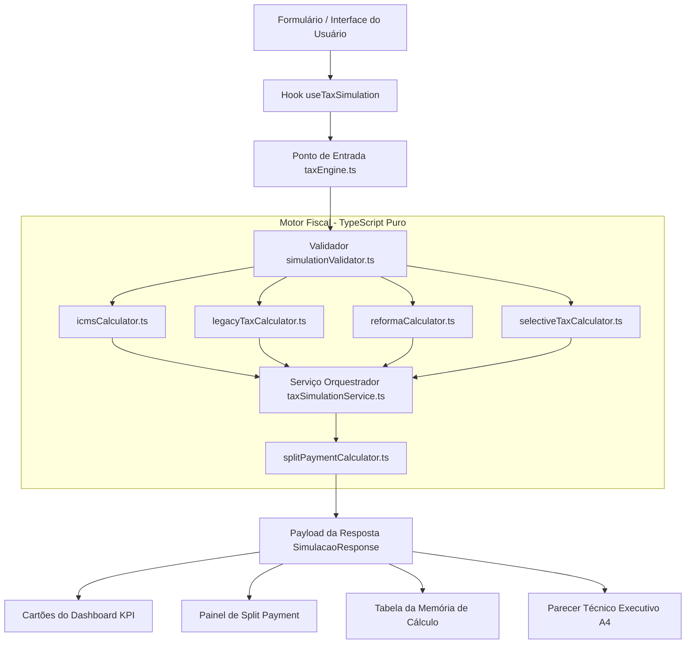

# Tax Reform Hub • Simulador Executivo IBS / CBS / ZFM

[](README.pt-BR.md)
[](README.md)
[](https://www.typescriptlang.org/)
[](https://react.dev/)
[](https://vitejs.dev/)
[](https://tailwindcss.com/)
[](LICENSE)

Plataforma corporativa de simulação fiscal e emissão de pareceres executivos que calcula a transição do sistema tributário atual (PIS, COFINS, ICMS, ISS, Simples Nacional) para o novo IVA Dual (CBS, IBS, Imposto Seletivo), contemplando as regras da Zona Franca de Manaus (ZFM) e a retenção do Split Payment.

---

## 1. Título & Proposta de Valor

- **O que é o projeto:** Plataforma de simulação e memória de cálculo auditável para a Reforma Tributária (EC 132/2023 e PLP 68/2024).
- **Quem pode utilizá-lo:** Diretores Financeiros (CFOs), advogados tributaristas, contadores corporativos, controllers e arquitetos de sistemas ERP.
- **Qual problema resolve:** Elimina incertezas sobre a variação de carga tributária, incentivos da ZFM (Art. 92-B do ADCT), Tese do Século do STF (Tema 69) e retenções de caixa no Split Payment.
- **Principal benefício:** Oferece comparações em tempo real e exporta pareceres técnicos A4 em PDF em menos de um segundo.

---

## 2. Badges

| Badge | Indicador | Propósito |
| :--- | :--- | :--- |
| **Idioma** | Português / English | Links para documentação bilingue |
| **TypeScript** | v5.8 | Tipagem estrita e prevenção de erros em tempo de execução |
| **React** | v19.0 | Renderização reativa e gerenciamento de estado via Hooks |
| **Vite** | v6.2 | Servidor de desenvolvimento rápido e bundler otimizado |
| **Tailwind CSS**| v4.0 | Estilização utilitária e regras de impressão `@media print` |
| **License** | Apache 2.0 | Licença corporativa open-source |

---

## 3. Demonstração

- **Link da Aplicação:** [Acessar Simulador ao Vivo](https://1tax-reform-zfmvatsimulator2.ai.studio)
- **Navegação Interativa:** Abas para **Dashboard de KPIs**, **Split Payment**, **Memória de Cálculo Auditável** e **Parecer Técnico A4**.

---

## 4. Problema e Escopo

### O Problema
A Reforma Tributária substitui cinco tributos (PIS, COFINS, ICMS, ISS e IPI) pelo IVA Dual (CBS e IBS) e pelo Imposto Seletivo (IS). As equipes fiscais enfrentam desafios para:
1. Prever o impacto no fluxo de caixa provocado pelo **Split Payment** (retenção bancária instantânea - PLP 68/2024).
2. Preservar a competitividade da Zona Franca de Manaus (ZFM / PIM) com o **Crédito Presumido do IBS/CBS** (Art. 92-B do ADCT).
3. Aplicar corretamente a Tese do Século do STF (RE 574.706 - exclusão do ICMS da base do PIS/COFINS).

### Dentro do Escopo
- Comparativo em tempo real: Legislação Vigente vs. Reforma Tributária.
- Alíquotas do IVA Dual (CBS 8,80% + IBS 17,70% = 26,50% referência).
- Reduções setoriais constitucionais (30% para profissões regulamentadas; 60% para Saúde, Educação e Agropecuária).
- Regras da Zona Franca de Manaus (ZFM): Crédito Presumido de IBS/CBS, Isenção do Convênio ICMS 65/88 e Isenção do IS para empresas com PPB.
- Três modalidades de Split Payment (Automático B2B, Simplificado B2C e Analógico/Dinheiro).
- Emissão de Parecer Técnico A4 com impressão e exportação em PDF.

### Fora do Escopo
- Transmissão direta de obrigações acessórias ao SPED ou Receita Federal.
- Calculador de parcelamento ou transação de débitos passivos.

---

## 5. Arquitetura

O sistema adota **Clean Architecture** e **Domain-Driven Design (DDD)**. O motor fiscal em `/src/domain` é desenvolvido em TypeScript puro, totalmente desacoplado da interface gráfica do React.



---

## 6. Stack Tecnológica

| Área | Tecnologia | Versão | Função |
| :--- | :--- | :--- | :--- |
| **Linguagem** | TypeScript | 5.8 | Regras de negócio do domínio e tipagem estrita |
| **Interface** | React | 19.0 | Renderização de componentes e gerenciamento de estado |
| **Ferramenta de Build** | Vite | 6.2 | Servidor de desenvolvimento e compilação de produção |
| **Estilização** | Tailwind CSS | 4.0 | Layout responsivo e regras para impressão em PDF |
| **Ícones** | Lucide React | 0.475 | Conjunto de ícones vetoriais corporativos |
| **Geração de PDF** | html2pdf.js | 0.10.2 | Vetorização e download de pareceres técnicos em PDF |

---

## 7. Configuração e Variáveis de Ambiente

O projeto é executado no lado do cliente (client-side) e não exige banco de dados local. O arquivo `.env.example` está incluído na raiz do projeto:

```env
# APP_URL: URL base da aplicação
APP_URL="http://localhost:3000"
```

| Variável | Obrigatória? | Padrão | Descrição |
| :--- | :---: | :--- | :--- |
| `APP_URL` | Opcional | `http://localhost:3000` | Endereço raiz da aplicação |

---

## 8. Instalação e Execução

### Pré-requisitos
- **Node.js:** v18.0.0 ou superior
- **npm:** v9.0.0 ou superior

### Execução Local

```bash
# 1. Clonar o repositório
git clone https://github.com/mello-lucas26Ds/TaxReform.AI-ZFM-Dual-VAT-Simulator.git

# 2. Entrar no diretório do projeto
cd TaxReform.AI-ZFM-Dual-VAT-Simulator

# 3. Instalar dependências
npm install

# 4. Iniciar servidor de desenvolvimento
npm run dev
```

Acesse `http://localhost:3000` em seu navegador.

### Suporte a Docker

```bash
# Gerar imagem da aplicação
docker build -t taxreform-dual-vat-simulator:latest .

# Executar contêiner na porta 8080
docker run -d -p 8080:80 --name tax-simulator taxreform-dual-vat-simulator:latest

# Encerrar contêiner
docker stop tax-simulator && docker rm tax-simulator
```

---

## 9. API do Motor Fiscal & Exemplo de Dados

O motor fiscal é exportado como uma função pura em TypeScript: `executarSimulacaoTributaria(input: SimulacaoInput): SimulacaoResponse`.

### Exemplo de Entrada (Payload)

```json
{
  "cnpj": "04.253.123/0001-88",
  "uf_origem": "SP",
  "uf_destino": "AM",
  "regime_zfm": "ZFM_POLO_INDUSTRIAL",
  "cumpre_ppb": true,
  "ncm": "2202.10.00",
  "cfop": "6102",
  "tipo_operacao": "VENDA_ESTABELECIMENTO",
  "valor_operacao": 5000.00,
  "tipo_icms_mode": "AUTOMATICO",
  "beneficio_fiscal": null,
  "regime_tributario": "LUCRO_PRESUMIDO",
  "split_modalidade": "AUTOMATICO"
}
```

### Exemplo de Resposta de Auditoria

```json
{
  "status": "sucesso",
  "tributos": {
    "cbs": 0.00,
    "ibs": 0.00,
    "is": 0.00,
    "credito_presumido_zfm": 487.50,
    "total_tributo": 0.00
  },
  "tributos_hoje": {
    "pis": 0.00,
    "cofins": 0.00,
    "icms_iss": 0.00,
    "total_hoje": 0.00
  },
  "diferenca_tributos": {
    "valor": 0.00,
    "porcentagem": 0.00,
    "tipo": "NEUTRO"
  },
  "split_payment": {
    "modalidade": "AUTOMATICO",
    "total_retencao_split": 0.00,
    "valor_liquido_vendedor": 5000.00,
    "percentual_retencao_efetiva": 0.00
  }
}
```

---

## 10. Testes e Qualidade

O projeto possui 100% de conformidade de tipos e regras do compilador.

```bash
# Executar verificação estática do TypeScript
npm run lint

# Testar build de produção
npm run build
```

---

## 11. Deploy e Operação

Para gerar os artefatos de produção:

```bash
npm run build
npm run preview
```

Os arquivos compilados na pasta `/dist` podem ser servidos diretamente em servidores Nginx, Cloud Run ou instâncias estáticas.

---

## 12. Segurança e Governança

- **Zero Armazenamento Externo:** Todas as operações ocorrem **100% na memória local do navegador**.
- **Sem Banco de Dados Exposto:** Anula riscos de SQL Injection ou Remote Code Execution (RCE).
- **Política de Segurança:** Consulte [SECURITY.md](SECURITY.md) para diretrizes de comunicação técnica.

---

## 13. Decisões Técnicas e Trade-offs

- **Motor Fiscal em TypeScript Puro:** Isolar `/src/domain` permite que a lógica fiscal seja reutilizada em backends Node.js ou ferramentas CLI sem modificação.
- **Arquitetura Client-Side SPA:** Zera custos de infraestrutura e assegura conformidade automática com a LGPD, já que dados fiscais não trafegam pela rede.
- **Exportação em PDF via html2pdf.js:** Oferece download de PDFs diretamente no navegador sem dependência de headless browsers no servidor.

---

## 14. Contribuição

Contribuições são bem-vindas! Consulte o arquivo [CONTRIBUTING.md](CONTRIBUTING.md) antes de enviar Pull Requests.

---

## 15. Licença

Distribuído sob a licença **Apache 2.0**. Consulte [LICENSE](LICENSE) para mais detalhes.
